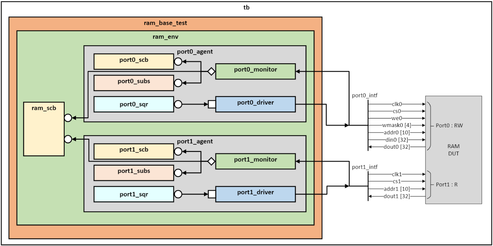

# RAM UVM
## Project architecture

This diagram is an overview of UVM project

## UVM folder hierachy

Ensure to keep the hiearchy model in folders:

    ├── main/                   
    |   ├── rtl/
    |   |   ├── *.sv
    |   |   ├── *.v
    |   ├── verif/
    |   |   ├── env/
    |   |   |   ├── ram_env.svh
    |   |   |   ├── ram_scp.svh
    |   |   |   ├── port0_agent/
    |   |   |   |   ├── ram_port0_monitor.svh
    |   |   |   |   ├── ram_port0_driver.svh
    |   |   |   |   ├── ram_port0_sqr.svh
    |   |   |   |   ├── ram_port0_subs.svh
    |   |   |   |   ├── ram_port0_scb.svh     
    |   |   |   ├── port1_agent/
    |   |   |   |   ├── ram_port1_monitor.svh
    |   |   |   |   ├── ram_port1_driver.svh
    |   |   |   |   ├── ram_port1_sqr.svh
    |   |   |   |   ├── ram_port1_subs.svh
    |   |   |   |   ├── ram_port1_scb.svh   
    |   |   ├── intf/
    |   |   |   ├── ram_port0_intf.sv
    |   |   |   ├── ram_port1_intf.sv
    |   |   ├── seq/
    |   |   |   ├── ram_port0_base_seq.svh
    |   |   |   ├── ram_port1_base_seq.svh
    |   |   ├── tb/
    |   |   |   ├── tb.sv
    |   |   ├── test/
    |   |   |   ├── ram_base_test.svh

